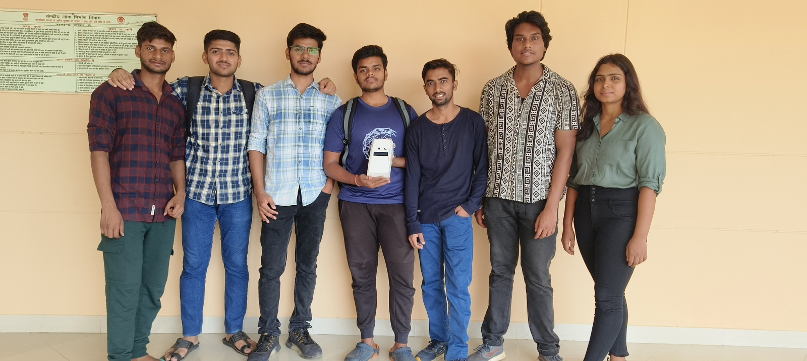

# PDPM IIITDM Jabalpur
## Design and Fabrication Project
### Title : IoT Contactless Doorbell security system

Hey there👋🏻, introducing you to the Modern Contactless doorbell security system that not only ensures your security but also health safety with much more convenience.


#### Video of working prototype: https://drive.google.com/file/d/1xsON2LM_GRcQmCZmgE2IUAxD9q-2tZq_/view?usp=share_link

### Photos of prototype


### How to run 

```
1. Run an instance of Raspberry Pi on your Laptop (using puTTY and VNC viewer)
2. Connect power supply with Raspberry Pi.
3. Connect Raspberry to your laptop using a LAN cable
4. Clone this repo to any directory in Raspberry Pi instance
5. Run the main.py file (using Thonny - Raspberry Pi's inbuilt Code editor)
```

##### Note: You will need to create your own telegram bot and replace the BotToken, ChatID with your own.

### Contributors



1. Sparsh Kumar
2. Siddharth Gupta
3. Digambar Kishore Patil
4. Sanjana Kumari Sharma
5. Aman Yadav
6. Manish Saini
7. Abhinav Singh

### Thank You
